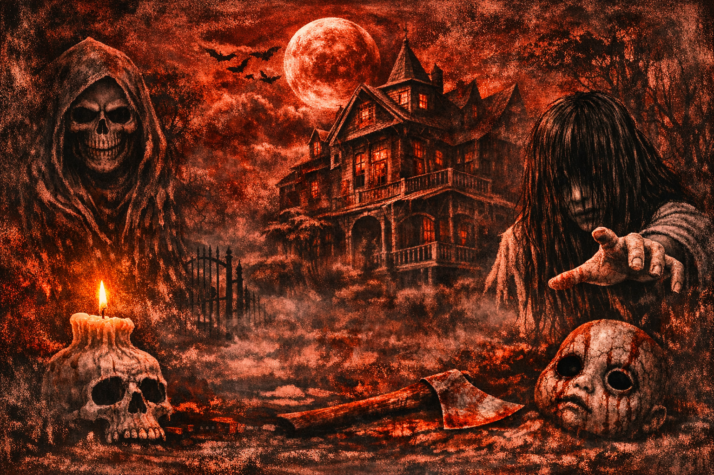

## (LA CASA DEL TERROR)

Proyecto de Creación Multimedia Interactiva de la  Facultad de Bellas Artes de la Univesidad de Granada

# 1 Datos 

**Titulo** : La casa del terror

**Web:**  

**Autor:**  Mª Eugenia Baena Alaminos

 [Profile Card](cmi-card.html)  [Alternate Profile Card](cmi-card2.html)

**Resumen** : Mi juego es una experiencia de terror en la que el jugador debe explorar un entorno inquietante mientras distintos objetos comienzan a desaparecer misteriosamente. A lo largo de la aventura, tendrá que encontrar pistas, recuperar cosas perdidas y descubrir llaves ocultas para desbloquear nuevas zonas y finalmente escapar antes de que sea demasiado tarde.

**Estilo/género:**  Juego de terror

**Logotipo** : 

**Resolución:** 1920×1080 aprox (algunas varian)

**Probado en:**   PC, ich.io, Windows, webs...

**Tamaño proyecto:** 53,2MB

**Licencia** Este proyecto tiene una Licencia CC Reconocimiento Compartir igual (CC BY-SA)

**Fecha** : 28/05/2026

**Medios** (donde se tiene presencia relacionada):

- Github:
- Twitter
- Instagram

**Web:**   (url github.io)

**Autor:**  (Mª Eugenia Baena Alaminos) 

 [Profile Card](cmi-card.html)  [Alternate Profile Card](cmi-card2.html)

**Resumen** : La Casa del Terror es un juego de misterio y terror donde los jugadores deberán explorar una casa oscura y llena de secretos mientras buscan objetos que desaparecen poco a poco. Cada habitación guarda pistas, sorpresas y desafíos que pondrán a prueba la memoria y la atención del jugador.

A medida que avanza la partida, los objetos cambian de lugar o desaparecen completamente, creando una experiencia tensa e impredecible. El objetivo es encontrar todas las cosas antes de que sea demasiado tarde y descubrir qué ocurre realmente dentro de la casa.

Características:

Ambiente de terror inmersivo.
Objetos ocultos que desaparecen dinámicamente.
Exploración de habitaciones misteriosas.
Efectos de sonido y tensión constante.
Experiencia corta pero intensa..

**Estilo/género:**  Juego de terror

**Logotipo** : (insertar imagen y breve justificación, si  tiene) 

(insertar imágenes a resolucion de 100px alto)

**Resolución:** 800x600px responsivo/o tamaño fijo (indicar la que has aplicado, y si es reescalable)

**Probado en:**   (indicar dónde has probado que funciona: ej. Google Chrome / MS Edge... /móviles android )

**Tamaño proyecto:** 14MB 

**Licencia** Este proyecto tiene una Licencia CC Reconocimiento Compartir igual (CC BY-SA)

**Fecha** : 28/05/2026

**Medios** (donde se tiene presencia relacionada):

- Github:
- Twitter
- Instagram

# 2. Memoria del proyecto 

### 2.1 Storyboard: 
En La Casa del Terror, el jugador despierta atrapado en una casa misteriosa y oscura. Para poder escapar, deberá recorrer tres escenas diferentes, cada una más difícil y aterradora que la anterior.

En cada escenario hay una llave escondida que el jugador debe encontrar mientras explora habitaciones llenas de tensión y objetos que desaparecen inesperadamente. A medida que avanza, el ambiente se vuelve más inquietante y los desafíos aumentan, poniendo a prueba la atención y el valor del jugador.

Solo consiguiendo las tres llaves será posible abrir la salida y escapar de la casa antes de quedar atrapado para siempre

### 2.2. Esquema de navegación 

(imagen con las distintas pantallas de navegación, usa draw.io o cualquier programa de dibujo)

# 3. Metodología

Metodología de desarrollo de productos multimedia basado en una metodología de UX (User Experience)

## Etapa 1: Ideación de proyecto

**Investigación de campo** (propuestas inspiradoras para el proyecto)

- Portfolio [Leonardi Web page](http://www.rleonardi.com/interactive-resume/) para idear cómo organizar el material
- 

**Motivación de la propuesta** 

Este  proyecto es interesante porque combina terror, exploración y resolución de acertijos en una experiencia interactiva que mantiene al jugador atento en todo momento. Además de entretener, el juego pone a prueba habilidades como la observación, la memoria y la capacidad de resolver problemas bajo presión.

También demuestra creatividad y diseño de niveles progresivos, ya que las escenas aumentan de dificultad para ofrecer un reto constante. El sistema de objetos y llaves escondidas crea tensión y hace que cada partida sea más interesante e inmersiva.

Como proyecto, La Casa del Terror refleja el desarrollo de mecánicas de juego, ambientación y narrativa, mostrando cómo una idea sencilla puede convertirse en una experiencia divertida y emocionante para los jugadores.

**Publico / audiencia**

- Orientado a jugadores que disfrutan los juegos de terror, misterio y exploración. Está pensado especialmente para:

Personas que buscan experiencias de suspense y tensión.
Jugadores jóvenes y adolescentes interesados en desafíos y acertijos.
Fans de los juegos de objetos ocultos y escape rooms.
Usuarios que disfrutan explorar escenarios y descubrir secretos.

Por su temática de terror, el juego está más orientado a un público de aproximadamente 12 años en adelante, dependiendo del nivel de miedo y la ambientación que tenga el proyecto.

## Etapa 2: Desarrollo / actividades realizadas

- Trailer inicial
- Menú y elementos de navegación (botones) con opciones de dificultad
- Juego en escenas (fácil,medio,dificil) 
- Video 

## Etapa 3: Problemas identificados

Pienso que en algunos casos me he complicado mucho y deberia de haber buscado soluciones más fáciles.

# 4. Conclusiones 

Pienso que he logrado lo que esperaba, sobretodo mi idea principal, además nunca he hecho algo así, aunque se puede mejorar con más tiempo.

# 5 Referencias 

**Artículos y blogs** 

- Crofts, S., Fox, M., Retsema, A. and Williams, B. (2005) *Podcasting: A new technology in search of viable business models*First Monday, 10(9). https://doi.org/10.5210/fm.v10i9.1273. Recuperado el 8 de abril de 2020 de: https://journals.uic.edu/ojs/index.php/fm/article/view/1273/1193

**Recursos y materiales audiovisuales:**

* Musica:  
* Imágenes:  
* Tipografía: 

**Herramientas utilizadas**

- Godot Engine 4.x
- 

(imagen de la licencia, copiar y pegar aquí la correcta)
https://creativecommons.org/licenses/?lang=es

* logos en https://creativecommons.org/mission/downloads/
  
  </small>

